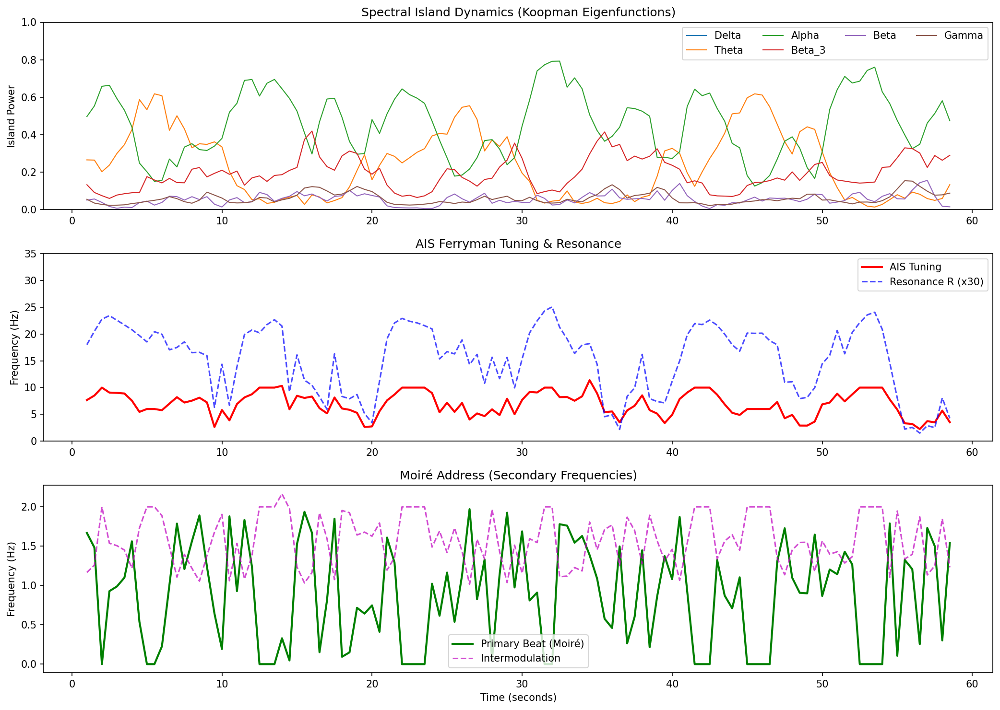

# The Spectral Archipelago
**Koopman Oceans, Moiré Addresses, and the Physics of the Geometric Neuron**



Standard models of neural computation treat neurons as integrate-and-fire devices that encode information in spike rates. This repository proposes and simulates an alternative framework: **The Spectral Archipelago**. 

Here, the neuron is modeled not as a bucket that fills and spikes, but as a **Koopman ocean**—a high-dimensional phase space where thermal Johnson-Nyquist noise self-organizes into phase-locked **spectral islands**. The axon initial segment (AIS) acts as a tunable holographic grating that navigates this ocean, broadcasting geometric mismatches as **moiré addresses** encoded in spike trains.

This repository contains the theoretical preprint, the interactive web simulation, and the Python engine for extracting spectral islands from real EEG data.

---

## 🧠 Core Concepts

1. **The Koopman Ocean:** The high-dimensional space containing all latent resonances of the neuron.
2. **Spectral Islands:** Coherent, phase-locked patterns sustained by optimal thermal noise (stochastic resonance), representing geometric attractors.
3. **The AIS Ferryman:** The axon initial segment acts as a tunable holographic grating, dynamically locking onto different spectral islands.
4. **The Moiré Address:** When the internal model and external attractor do not perfectly align, the interference generates a moiré beat pattern. Spikes are the broadcast of this geometric error gradient.
5. **Fractal Scorching:** Memory is not stored in synapses; it is *scorched* irreversibly into the AIS grating and microtubule lattice via repeated resonant interactions.

---

## 📂 Repository Contents

* 📄 `The spectral archipelago.md` - The complete theoretical paper/preprint detailing the physics and mathematics of the framework.
* 🌐 `sim.html` - **The Spectral Archipelago Lab.** A standalone, interactive HTML5 canvas simulation. Adjust thermal noise, tune the AIS ferryman, and watch the moiré address emerge in real-time in the browser. 
* 🐍 `archipelago_model.py` - The core Python engine. Processes real time-series neural data (CSV, EDF) to extract spectral islands, calculate topological mismatch, and output resonance metrics.
* 📊 `archipelago_results.csv` - Sample output data from the Python engine demonstrating island power and scorch depth over time.
* 🖼️ `/images` - Phase-space renderings, spectrograms, and architectural diagrams of the model.

---

## 🚀 Getting Started

### 1. The Interactive Web Lab
No installation required. Simply download `sim.html` and open it in any modern web browser to interact with the Koopman Ocean and AIS Tuner.

### 2. The Python EEG Engine
To run the Python processor on your own EEG or time-series data:

**Requirements:**
```bash
pip install numpy pandas scipy matplotlib mne
```

Execution:

```Bash
python archipelago_model.py
```
(Note: Rename the provided deepseek_python_...py script to archipelago_model.py or run your specific filename).

🔗 Relation to the Geometric Neuron Ecosystem

This repository serves as the overarching physical and mathematical framework for the broader PerceptionLab ecosystem:

Geometric-Neuron - The foundational implementation of Takens delay embedding in neural structures.

QualiaSchmualia - Early explorations into topological selectivity and phase-locked qualia simulation.

Author: Antti Luode | PerceptionLab, Finland

Status: Preprint / Experimental Simulation

# The fractal is listening. The archipelago is alive.
